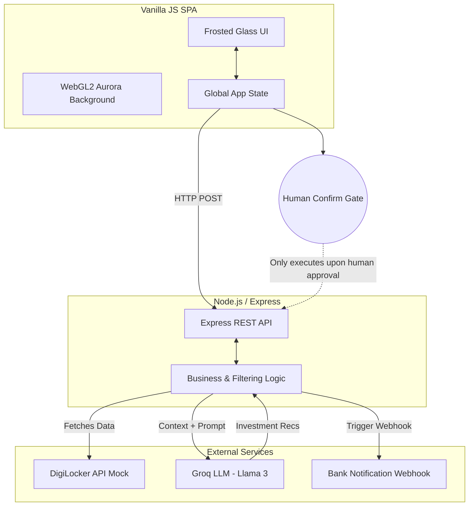

# FundPath 🎓📈

FundPath is a comprehensive web app that bridges the gap between scholarship discovery and long-term wealth management. It matches students with eligible grants using an AI agent, and once an award is accepted, helps them allocate and invest those funds wisely with human-in-the-loop AI assistance.

## 🚀 Getting Started

These instructions will get you a copy of the project up and running on your local machine.

### Prerequisites

- [Node.js](https://nodejs.org/) (v16 or higher)
- A [Groq API Key](https://console.groq.com/) for the AI investment recommendations

### Installation

1. **Clone the repository**
   ```bash
   git clone https://github.com/yourusername/fundpath.git
   cd fundpath
   ```

2. **Install dependencies**
   Navigate to the backend directory and install the required packages:
   ```bash
   cd backend
   npm install
   ```

3. **Set up Environment Variables**
   Create a `.env` file in the `backend` directory and add your Groq API key:
   ```env
   GROQ_API_KEY=your_actual_api_key_here
   ```

4. **Run the server**
   ```bash
   node server.js
   ```
   The backend will start on `http://localhost:3001` and automatically serve the frontend files.

5. **Open the app**
   Open your browser and navigate to `http://localhost:3001`.

---

## 🏗️ Architecture Diagram



---
